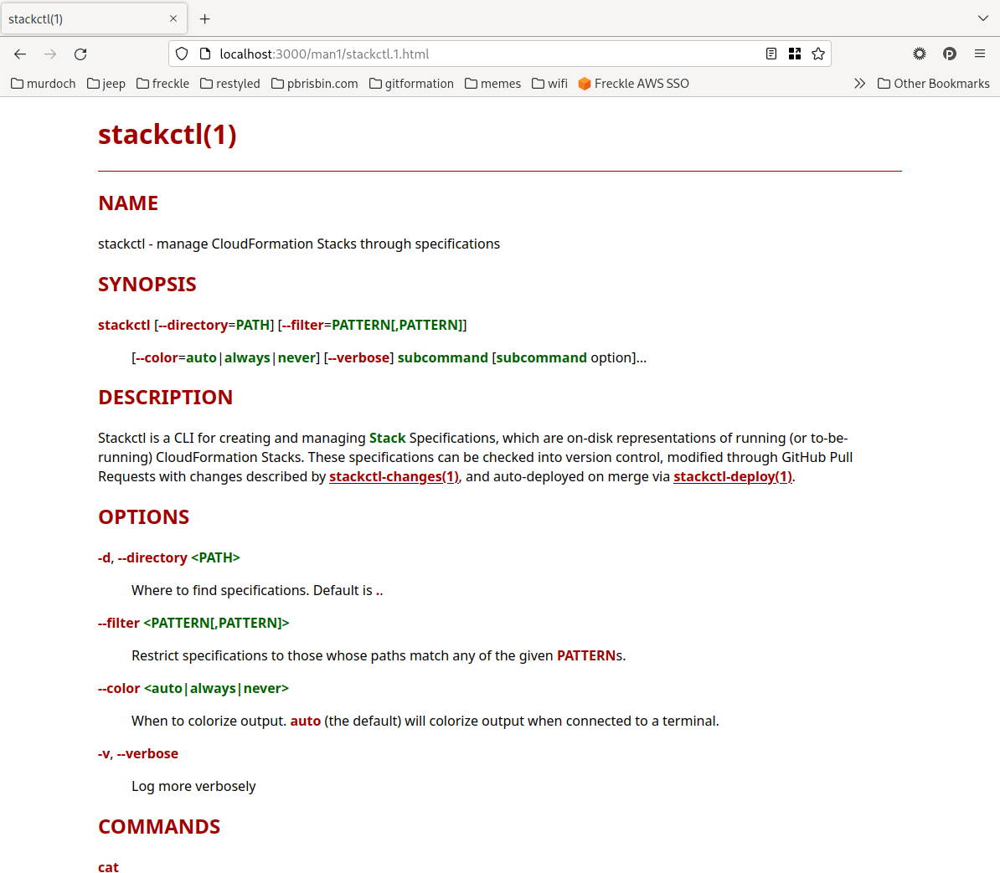

# Bluebook

Render / web-server for man-pages present on (I assume) Unix-like systems.

## Usage

```console
bluebook
```

Launches a web server where the local man-pages can be browsed.



## Configuration

- `PORT`: port to listen on, default is `3000`
- `MANPATH`: used to define where to search for man-pages, default is

  ```
  $HOME/.local/share/man:/usr/local/share/man:/usr/share/man
  ```

## Motivation

**Why not use [die.net](https://linux.die.net/man/), or
[kernel.org](https://www.kernel.org/doc/man-pages/),
[man7](https://man7.org/linux/man-pages/index.html)?**

At work, we write a handful of CLI tools that are thoroughly documented through
man-pages that get installed with the tool. It is super useful to have these
also be online-browsable, particularly with references to other pages linked and
traversable. Unfortunately, this rules out sites such as above as they'd never
contain our man-pages.

**Why not use [existing tool]?**

I could not find a tool that did the minimal things I need:

- Convert local man-pages to HTML
- Turn headers into linkable anchors
- Turn text like `foo(1)` into links to `man1/foo.1.html`

If you know of such a tool, do let me know!

## Development

We use the Haskell tool Stack:

```console
stack build --fast --test --file-watch --exec 'bash -c "pkill bluebook; stack exec bluebook &"'
```

---

[LICENSE](./LICENSE) | [CHANGELOG](./CHANGELOG.md)
